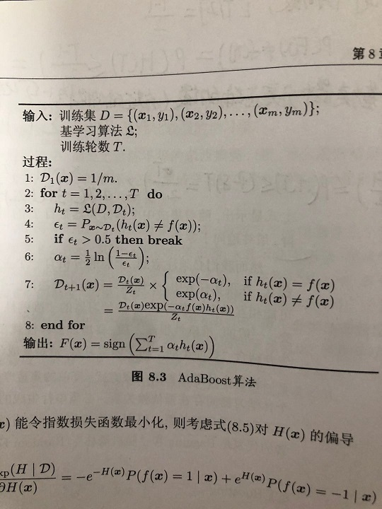

# Adaboost(adaptive boosting)学习笔记附源代码
* 作者:DingMin
* 日期:2020/7/25   
PS：作为学习笔记，这里按照我学习之后的通俗理解来写，欢迎一起交流学习

## 1.算法的核心思想  
由弱分类器的线性组合来生成一个强分类器，这个强分类器使得指数损失函数最小化。等价于从弱分类器中分类效果好的分配到一个更大的的权值。
     

---------------------

## 2.算法伪代码

-------------------------
## 3.算法推导  
损失函数: $$ a+b=\mu  $$

	

